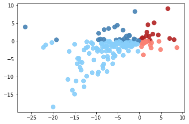
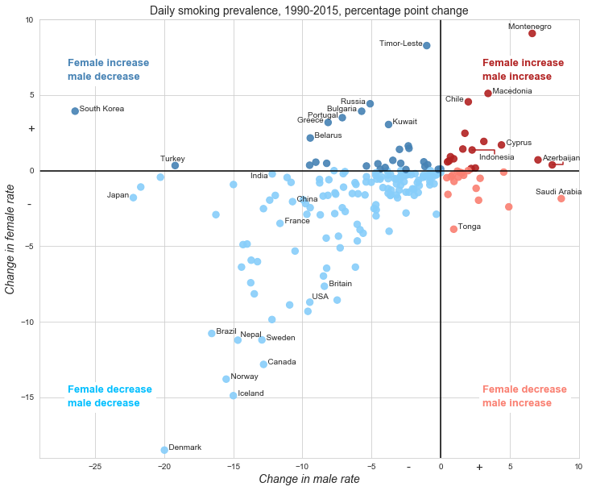

[]()

# Data Science Assessment

**This repository contains the code which is used to recreate the following image:**


# Solution

##### Obtaining the data
As mentioned within the image, the plot corresponds to the data published on *Lancet*, 2017. The publication can be accessed via the following link: https://www.thelancet.com/journals/lancet/article/PIIS0140-6736(17)30819-X/fulltext. Table 1 of the publication contains the age-standardized daily smoking prevalence in 2015 and (out of a dozen more) the annualised rate of change in prevalence from 1990-2015. The data is indexed by country. In order to calculate the percentage-point change between 1990 and 2015 we need to calculate the prevalence in 1990. It is mathematically straight forward to arrive to the 1990 prevalence by country using the compound annualised growth formula as shown before. We simply substitute *CAGR* with the annualised growth rate, *Ending Value* with the 2015 prevalence, *# of years* with 15 and solve for *Beginning Value* which represents the prevalence in 1990.


In order to extract and prepare the data, we built a class called scraper as seen below.


```python
class scraper: 
```

Within scraper we define numerous methods which all perform a certain task. The first method that we define is the one we use to fetch and parse the data from the publication site to our coding environment.

Within scraper we define numerous methods which all perform a certain task. The first method that we define is the one we use to fetch and parse the data from the publication site to our coding environment.


```python
    def ParFetch_url(self):
        fetched = requests.get('https://www.thelancet.com/journals/lancet/article/PIIS0140-6736(17)30819-X/fulltext')
        ftext = fetched.text
        bsc = bs(ftext, 'lxml')
        tbl = bsc.find('table')
        data_r = tbl.findAll('tr')
        return data_r
```

ParFetch_url makes use of two libraries, *requests* and *beautifulsoup4*. The *requests* library enables us to fetch the publication site's source code while *beautifulsoup4* enables us to find info within the code, such as the table in this case. We get every table row using *findAll* and we store them as data_r.

Next we define BuilData method.


```python
    def BuilData(self, data):
        row = []
        for d in data:
            row.append([r.text for r in d])
        return np.array(row)
```

BuilData takes data_r as an argument and scans every row. For every row, it looks at individual entries and extracts the text part (which is the actual entry in the table seen in the site). Each row is now stored in a list. All of the row lists are themselves stored in another list called *row*. The method returns *row* as a numpy array. 

These two methods together give us all the relevant data from the publication.

##### Preparing the data

The rest of the methods inside the class deal with data preparation. In BuilData, we extracted the text part from data_r rows. Therefore, our data is in string format. It turns out that the format of the decimals within the data is wrong. Namely, instead of a normal point '.', we have '·', and instead of a normal minus sign '-', we have '−'. We need to replace these ('·', '−') with ('.', '-') if we want to have the decimals as type *float*. Additionally, every prevalence estimate is followed by a confidence interval within parantheses. We want remove the confidence interval and only maintain the estimate. This is one of the main things that the following fixData method does.


```python
 def fixData(self, arr):
        data_dict = {arr[0][i]:arr[1:].T[i] for i in [2,3,4,5]}
        data_dict['Country'] = arr[1:].T[0]
        data_DF = pd.DataFrame(data_dict)
        data_DF.replace({'·':'.', '−':'-'}, inplace = True, regex = True) 
        for i in range(4):
            data_DF[data_DF.columns[i]] = data_DF[data_DF.columns[i]].apply(lambda x: float(x.partition(" (")[0]))
        return data_DF
```

The array the BuilData returns contains all of the rows of the table. By default, the first row is going to correspond to the table headers. If we ignore the first row and transpose all of the other rows, instead of each list within the array corresponding to an individual row, we'll have each list within the array corresponding to an individual column. In fixData, we build data_dict using that information and the fact that the data which is relevant to us are located in the 3rd, fth, 5th, and 6th columns. The dictionary keys are the members of the first row (i.e. the column names) and the values are the members of the array transposed (i.e. the columns). We also need the Country column and add it manually since in the table, the country column name is blank as it is an index. We turn this dictionary into a Pandas data frame and use the replace function to replace '·'  with '.', and '−' with '-'. Then, for every column, we partition the text in two parts. The first part contains the part of the text before the " (" and the second part contains the rest of the text. The parts are stored in a list and in order to extract only the estimate, we keep only the first member of the list and then we turn it into type float. Naturally, we use apply/lambda for this. The resulting dataframe is returned by the method. 

The next very important method is  PPCH method which referrs to the point-probability change.


```python
def PPCH(self, df):
        le_DF = pd.DataFrame()
        fq = df[df.columns[2]].apply(lambda x: math.pow(1+(x/100), 25))
        mq = df[df.columns[3]].apply(lambda x: math.pow(1+(x/100), 25))
        Fperc95 = df[df.columns[0]]/fq
        Mperc95 = df[df.columns[1]]/mq
        le_DF['Change in female rate'] = df[df.columns[0]]-Fperc95
        le_DF['Change in male rate'] = df[df.columns[1]]-Mperc95
        le_DF['SgnF'] = le_DF['Change in female rate'].apply(lambda x: 1 if x>0 else 0)
        le_DF['SgnM'] = le_DF['Change in male rate'].apply(lambda x: 1 if x>0 else 0)
        le_DF['Code'] = [f'{i}{j}' for i,j in zip(list(le_DF.SgnF), list(le_DF.SgnM))]
        le_DF['Color'] = le_DF['Code'].map({'00': 'lightskyblue', '10': 'steelblue', 
                                               '01':'salmon', '11':'firebrick'})
        le_DF['Country'] = df.Country
        le_DF.replace({'UK':'Britain'}, inplace = True, regex = True)
        
        return le_DF[le_DF.columns[[6,0,1,4,5]]]
```

PPCH will take as an argument the data frame from fixData. The method first makes an empty data frame, le_DF. Then, for the columns corresponding to annualised growth in fixData, it will divide them by 100 (to turn them into growth/decay rates). Then it adds 1 to them and takes the power of 25 of the resulting sum. It will store the columns (as series) sa *fq* and *mq* (female, male). The smoking prevalence in 1995 is found by dividing 2015 male prevalence by *mq* and the female prevalence by *fq*. The method does that and stores the 1995 prevalences as *Fperc95* and *Mperc95*. Then, it adds the first columns to le_DF which correspond to the percent-point changes of prevalences for males and females (1995-2015). It adds two additional columns (*SgnM*, *SgnF*) corresponding to the signs (not the true sign) of percentage-point changes of males and females. E.g., if, for a country, the percentage-point changes for females and males are is -1.5% and 5% respectively, then *SgnM*, *SgnF* will be 0, 1. A negative value is mapped to 0 and a positive value to 1. A new column, called *Code* will store the signs are string, in the above example, *Code* will be '01'. Depending on the *Code*, a defined color will be mapped to each row of le_DF (it will be stored as another column called *Color*). The replace function will be called to replace the country 'UK' with 'Britain'. Normally, if we want to fully replicate the Economics graph, we would need to replace 'USA' with 'United States' but since 'USA' fits much better in the plot, we don't change it. The method will return le_DF with column country as the first one and the rest of the columns corresponding to point-percent prevalence change for males & females, code, and color.

The last method, called run, executes all of the above methods iteratively and returns the last data frame as generated in the PPCH method.


```python
    def run(self):
        dta = self.ParFetch_url()
        lss = self.BuilData(dta)
        lss_DF = self.fixData(lss)
        les_DF = self.PPCH(lss_DF)
        return les_DF
```

Now that the whole class is defined, we call an instance of the class by running


```python
scr = scraper()
```

Then we execute everything and store the data frame as *DF* by running


```python
DF = scr.run()
```

The data frame will have the following format:


```python
DF[1:4]
```


<div>
<style scoped>
    .dataframe tbody tr th:only-of-type {
        vertical-align: middle;
    }

    .dataframe tbody tr th {
        vertical-align: top;
    }

    .dataframe thead th {
        text-align: right;
    }
</style>
<table border="1" class="dataframe">
  <thead>
    <tr style="text-align: right;">
      <th></th>
      <th>Country</th>
      <th>Change in female rate</th>
      <th>Change in male rate</th>
      <th>Code</th>
      <th>Color</th>
    </tr>
  </thead>
  <tbody>
    <tr>
      <th>1</th>
      <td>Afghanistan</td>
      <td>0.172745</td>
      <td>2.508683</td>
      <td>11</td>
      <td>firebrick</td>
    </tr>
    <tr>
      <th>2</th>
      <td>Albania</td>
      <td>0.000000</td>
      <td>-3.871610</td>
      <td>00</td>
      <td>lightskyblue</td>
    </tr>
    <tr>
      <th>3</th>
      <td>Algeria</td>
      <td>-6.383674</td>
      <td>-6.165432</td>
      <td>00</td>
      <td>lightskyblue</td>
    </tr>
  </tbody>
</table>
</div>


##### Creating the figure

Without any additional modification, the basic scatterplot is built using the matplotlib library. We run the following code:


```python
plt.scatter(x = 'Change in male rate', y = 'Change in female rate', color = DF.Color, alpha = 0.9, s = 70, data = DF)
plt.show()
```





Where the x-axis represents the percentage-point change in male smoking prevalence and the y-axis shows the percentage-point percentage-point change in female smoking prevalence. The color is mapped to the DF's color column.

##### Styling the figure

> The following list is the first details we add to the graph:
- **Need to add a grid**: This can be done via the Seaborn (library) styling.
- **Need to expose the x-axis and y-axis (from the origin)**: This can be done via matplotlib.pyplot (plt) axvline and axhline.
- **Need to add an x and y label**: This can be done via plt.xlabel and plt.ylabel.


```python
figure(figsize=(6, 5))
sns.set_style("whitegrid")
plt.scatter(x = 'Change in male rate', y = 'Change in female rate', color = DF.Color, alpha = 0.9, s = 70, data = DF)
plt.axvline(0, color='black')
plt.axhline(0, color='black')
plt.xlabel(DF.columns[2], fontsize = 14, style = 'italic')
plt.ylabel(DF.columns[1], fontsize = 14, style = 'italic')
plt.show()
```


Next, we added a description to each quarter of the code. In order to make the process more automated, we first prepared the following lists/dictionaries/functions.


```python
coords = [[-27,6.9], [-27,6.0], [-27,-14.7], [-27,-15.6], [3,6.9], [3,6.0], [3,-14.7], [3,-15.6]]
mapd = {6.9: 'Female increase', 3: 'male increase', -14.7: 'Female decrease', -27: 'male decrease'}
sgn = {-1.0:['steelblue', '',  'salmon'], 1.0:['deepskyblue', '',  'firebrick']}
mapp = lambda x: 1 if x%2 == 0 else 0
```

The *coords* list contains the coordinates where we add text. For any coordinate (list), if the second value (y coordinate) is 6.9 it means that it will be located where y is positive implying female increase. If it is -14.7, it implies female decrease. The same holds with the first value and male increase/decrease. We encode that information in the dictionary *mapd*. 

> Additionally:
- If the coordinates have the same sign, we're dealing with lower-left or top-right quarters (*case 1*).
- If the coordinates have different signs, we're dealing with lower-right or top-left quarters (*case 2*).

Knowing that information, we create *sgn* dictionary with keys equal to signs -1, 1.

If we are dealing with *case 1*, then there are two possible colors we can have, deepskyblue or firebrick.
If we are dealing with *case 2*, then there are two possible colors we can have, steelblue or salmon.

It is implied that adding 1 to the sign of the first coordinate will yield the correct position of the color in the *sgn* dictionary. 

We used all this information along with plt.text in order to update the plot further.


```python
figure(figsize=(12, 10))
sns.set_style("whitegrid")
plt.scatter(x = 'Change in male rate', y = 'Change in female rate', color = DF.Color, alpha = 0.9, s = 70, data = DF)
plt.axvline(0, color='black')
plt.axhline(0, color='black')
j = 2
for i in range(len(coords)):
    plt.text(coords[i][0], coords[i][1], mapd[coords[i][mapp(j)]], color = sgn[np.sign(coords[i][0]*coords[i][1])][1+np.sign(coords[i][0])], size = 13, fontweight = 'bold', bbox=dict(facecolor='white', alpha=1))                                                                            
    j+=1
plt.xlabel(DF.columns[2], fontsize = 14, style = 'italic')
plt.ylabel(DF.columns[1], fontsize = 14, style = 'italic')
plt.show()
```


Finally, we need to add labels to some of the data points. The labels are the countries. We need a '+' and a '-' signs in the axes and to cut the plot correctly. The first two details are done via plt.text while the third one via plt.xlim & plt.ylim. We defined which countries (names) should appear in the plot.


```python
countries = ['South Korea', 'Japan', 'Turkey', 'Denmark', 'Brazil', 'Norway', 'Iceland', 'Nepal', 'India', 'Canada', 'Sweden', 'Britain', 'France', 'China', 'Belarus', 'USA', 'Portugal', 'Greece', 'Bulgaria', 'Russia', 'Kuwait', 'Timor-Leste', 'Tonga', 'Chile', 'Indonesia', 'Cyprus', 'Macedonia', 'Montenegro', 'Azerbaijan', 'Saudi Arabia']
```


```python
figure(figsize=(12, 10))
sns.set_style("whitegrid")

plt.scatter(x = 'Change in male rate', y = 'Change in female rate', color = DF.Color, alpha = 0.9, s = 70, data = DF)
plt.axvline(0, color='black')
plt.axhline(0, color='black')


for c in countries:
    if c in ['Russia', 'Chile', 'Bulgaria', 'Portugal', 'Greece', 'Japan', 'Timor-Leste']:
        plt.text(DF[DF.Country == c]['Change in male rate'].values[0], DF[DF.Country == c]['Change in female rate'].values[0], f"{c}  ", in_layout = True, rasterized = True,horizontalalignment = 'right', verticalalignment = 'baseline', wrap = False)
    elif c in ['Montenegro', 'Turkey', 'Saudi Arabia']:
        plt.text(DF[DF.Country == c]['Change in male rate'].values[0], DF[DF.Country == c]['Change in female rate'].values[0]+0.2, f"{c}  ", in_layout = True, rasterized = True,horizontalalignment = 'center', verticalalignment = 'bottom', wrap = False)
    elif c == 'Indonesia':
        plt.text(DF[DF.Country == c]['Change in male rate'].values[0]+.5, DF[DF.Country == c]['Change in female rate'].values[0]-.5, f"{c}  ", in_layout = True, rasterized = True,horizontalalignment = 'left', verticalalignment = 'center', wrap = False)
        plt.plot([DF[DF.Country == c]['Change in male rate'].values[0]+1.6,DF[DF.Country == c]['Change in male rate'].values[0]+1.6,DF[DF.Country == c]['Change in male rate'].values[0]], [DF[DF.Country == c]['Change in female rate'].values[0]-.25, DF[DF.Country == c]['Change in female rate'].values[0], DF[DF.Country == c]['Change in female rate'].values[0]], color = 'firebrick')
    elif c == 'Azerbaijan':
        plt.text(DF[DF.Country == c]['Change in male rate'].values[0]+.8, DF[DF.Country == c]['Change in female rate'].values[0]+.2, f"{c}  ", in_layout = True, rasterized = True,horizontalalignment = 'center', verticalalignment = 'bottom', wrap = False)
        plt.plot([DF[DF.Country == c]['Change in male rate'].values[0],DF[DF.Country == c]['Change in male rate'].values[0]+.8, DF[DF.Country == c]['Change in male rate'].values[0]+.8], [DF[DF.Country == c]['Change in female rate'].values[0],DF[DF.Country == c]['Change in female rate'].values[0], DF[DF.Country == c]['Change in female rate'].values[0]+0.2], color = 'firebrick')
    elif c == 'India':
        plt.text(DF[DF.Country == c]['Change in male rate'].values[0], DF[DF.Country == c]['Change in female rate'].values[0]+.1, f"{c}  ", in_layout = True, rasterized = True,horizontalalignment = 'right', verticalalignment = 'top', wrap = False)
    elif c in ['Nepal', 'USA']:
        plt.text(DF[DF.Country == c]['Change in male rate'].values[0]-.14, DF[DF.Country == c]['Change in female rate'].values[0]+.21, f"  {c}", in_layout = True, rasterized = True, wrap = False)
    else:
        plt.text(DF[DF.Country == c]['Change in male rate'].values[0], DF[DF.Country == c]['Change in female rate'].values[0], f"  {c}", in_layout = True, rasterized = True, wrap = False)

j = 2
for i in range(len(coords)):
    plt.text(coords[i][0], coords[i][1], mapd[coords[i][mapp(j)]], color = sgn[np.sign(coords[i][0]*coords[i][1])][1+np.sign(coords[i][0])], size = 13, fontweight = 'bold', bbox=dict(facecolor='white', alpha=1))                                                                            
    j+=1

plt.xlabel(DF.columns[2], fontsize = 14, style = 'italic')
plt.ylabel(DF.columns[1], fontsize = 14, style = 'italic')
plt.title('Daily smoking prevalence, 1990-2015, percentage point change', fontsize = 14, fontweight = 'medium')

plt.text(-2.5, -19.898, '-', fontsize = 15)
plt.text(2.5, -19.898, '+', fontsize = 15)
plt.text(-29.898,-2.5, '-', fontsize = 15)
plt.text(-29.898,2.5, '+', fontsize = 15)
plt.xlim(-29, 10)
plt.ylim(-19, 10)

plt.show()
```





# Questions & Answers

**1) What was the most challenging part of this exercise?**

The most challenging part of this exercise was adding the country names to the plot. It was certainly not technically challenging but required a lot of time and iterations.

**2) What took you the longest?**

The answer to this question is the same as the first. It took me a long time to get every country name placed in an okay position.

**3) What did you enjoy the most?**

Building the scraper class as well as defining *mapd*, *sgn*, and *mapp*.

**4) What did you enjoy the least?**

Not that I didn't enjoy it, but I enjoyed making the plot less than the other parts.
